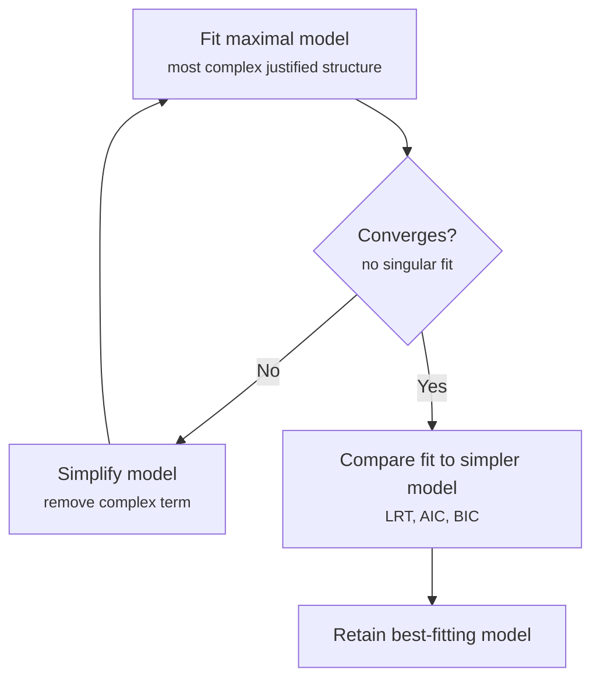

# Disclaimer
The following resource is a guide to fitting multilevel models in R and interpreting their output. It is a *functional* guide, **not** a substitute for a statistics textbook. Before consulting it, make sure you understand what multilevel modelling is, what it is for, and whether it is appropriate for your own research.

This [Datacamp guide](https://www.datacamp.com/tutorial/multilevel-modeling) is a nice, accessible resource for beginning to explore these initial questions.

## Step 1: Getting your data ready

Assuming your data is cleaned, there are some additional steps to take before fitting your models. Make sure:

* If you have categorical variables, you have selected a meaningful reference level for them (e.g., your control condition is coded as the reference level, 0)
* You have standardised your numeric variables, where it makes sense to do so (e.g., when you want to compare the relative importance of predictors measured on different scales)

## Step 2: Loading the necessary packages

There's a standard battery of packages that are useful for running MLMs:

```r
library(lme4)     # necessary for fitting MLMs (contains the core functions lmer(), glmer() and nlmer() for specifying models)
library(lmerTest) # gives you p-values and degrees of freedom in your model outputs
library(emmeans)  # necessary for computing estimated marginal means, which are used to test your hypotheses
```

## Step 3: Specifying your models

Ideally, you will already have written a pre-registration, in which you specified the models you planned to fit and how you would use them to test your hypotheses. If this is the case, simply follow your pre-registered analysis plan. If not, below are some tips on how to specify MLMs.

On the whole, MLM model specification is very similar to simple multiple regression, save for the random effects structure:

**Simple multiple regression model:**
```r
lm(DV ~ IV1 * IV2 + Covariate, data = df)
```

**Multilevel model:**
```r
lmer(DV ~ IV1 * IV2 + Covariate + (1 | Participant) + (1 | Scenario), data = df)
```

The complexity of the random effects structure depends on your study design, and specifically on the levels of nesting within your data. Very commonly, we include a by-participant random intercept, which accounts for individual differences between participants, and a by-scenario random intercept, which accounts for differences in responses between vignettes.

A more complex random effects structure will also include random slopes. Take, for example, a design where each participant views 4 vignettes, and each vignette is randomly assigned to express anger, fear, an unspecified emotion, or calm. This is a 4-level within-subjects categorical variable, and we might expect participants to respond differently to each emotion. In this case, we would also fit a random slope for Emotion by Participant, to account for that variation:

```r
lmer(DV ~ IV1 * IV2 + Covariate + (1 + Emotion | Participant) + (1 | Scenario), data = df)
```

Note that `(1 + Emotion | Participant)` fits both a random intercept *and* a random slope for Emotion within each participant — this is different from `(1 | Emotion) + (1 | Participant)`, which would treat Emotion and Participant as separate, unrelated grouping factors.

**Choosing a random effects structure**

To decide on the random effects structure to fit, follow these steps:

1. **Fit your maximal model** — the model with the most complex random effects structure that is theoretically defensible (e.g., including both random slopes and random intercepts).
2. **Check convergence.** If the model fails to converge, or gives a singular fit (both flagged by a warning in R), simplify the random effects structure iteratively until it converges.
3. **Compare model fit.** Once you have a converging model, compare it against a simpler alternative (e.g., random intercepts only) using a likelihood ratio test (LRT), AIC, and BIC, to assess which provides the better fit.
4. **Retain the best-fitting model** that still converges.



## Step 4: Interpret the output

To read a model's full output, people typically run:

```r
summary(mdl)
```

Because we loaded `lmerTest` in Step 2, this will include p-values for each fixed effect (calculated via Satterthwaite's approximation for degrees of freedom), alongside the usual coefficient estimates and standard errors.

However, for factors with more than two levels, a per-coefficient p-value in `summary()` only tells you about specific pairwise contrasts (e.g., a single experimental condition level vs. the reference level). To get a single, overall test of whether the effect matters at all, you need an omnibus F-test instead. It's therefore often more useful to run the following:

```r
anova(mdl)
```

This gives you a Type III ANOVA table with one F-test per predictor, which is typically what you'll want to report when testing your main hypotheses about a multi-level categorical predictor.

### Reading the `anova(mdl)` table

The output will look something like this:

```
Type III Analysis of Variance Table with Satterthwaite's method
             Sum Sq Mean Sq NumDF  DenDF F value  Pr(>F)  
IV1           12.34   12.34     1  45.20   8.912 0.00453 **
IV2            3.21    3.21     1  45.20   2.318 0.13487  
IV1:IV2        7.65    7.65     1  45.20   5.527 0.02301 *
Covariate      0.98    0.98     1 198.60   0.708 0.40120  
```

**Column guide:**

* **Sum Sq / Mean Sq** — sums of squares for that term. Rarely reported directly; used to compute the F value.
* **NumDF** — numerator degrees of freedom (the number of parameters used to test the term — 1 for a simple main effect, more for a multi-level factor like Emotion).
* **DenDF** — denominator degrees of freedom, calculated via Satterthwaite's approximation. This is what `lmerTest` adds — without it, `anova()` on an `lmer` model won't return a DenDF or p-value at all. DenDF can differ *between rows*, reflecting how much information is available to estimate each specific effect. A non-integer DenDF (e.g. 45.20) is normal and expected — it's not a bug, and no rounding is needed before interpreting the p-value.
* **F value** — the test statistic for that term.
* **Pr(>F)** — the p-value.

**What "Type III" means:** each effect is tested controlling for all other effects in the model, including interactions. This matters especially when interpreting main effects alongside an interaction — the main effect p-value reflects the effect *at the reference/average level* of the other predictor, not a marginal effect that ignores the interaction. If you have unordered factors, make sure your contrasts are sensible (`options(contrasts = c("contr.sum", "contr.poly"))` is standard for Type III tests) — otherwise Type III results can be misleading.

**How to read it, practically:**

1. **Check interaction terms first** (e.g. `IV1:IV2`). If significant, be cautious interpreting the main effects of `IV1` and `IV2` in isolation, since the effect of one likely depends on the level of the other. Follow up with `emmeans` for simple effects or pairwise contrasts.
2. **If no interaction is significant**, the main effect rows are more directly interpretable as-is.
3. **For a multi-level factor**, the `anova()` row gives one omnibus test — "does Emotion matter overall?" (NumDF = levels − 1). A significant result tells you *some* difference exists among conditions, but not *which* ones differ — that's where `emmeans` with pairwise comparisons comes in as the natural next step.

## Step 5: Decomposing interactions


